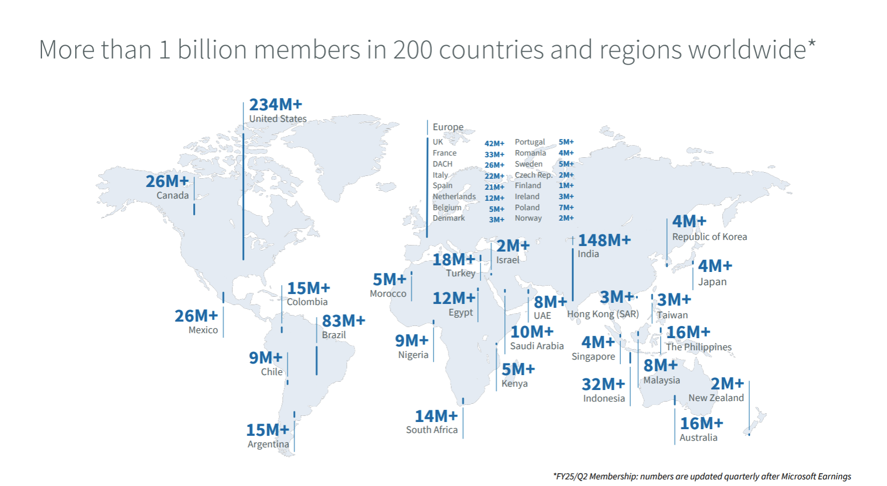

# Проектирование высоконагруженного сервиса на примере LinkedIn

[TOC]

## 1. Тема и целевая аудитория

LinkedIn -- социальная сеть для поиска и установления деловых контактов

### Целевая аудитория

LinkedIn является международным сервисом, распространенным по всему миру, общая аудитория которого более 1B пользователей.
Большая часть целевой аудитории расположена в США (234М+ пользователей), преимущественно мужчины (57%)[^1]. 
Количество активных пользователей в месяц (MAU) составляет ~310М[^2].

 
*Распределение пользователей по странам [^3]*

| Регион | Количество пользователей |
|--------------- | --------------- |
| Северная Америка | 260M+ |
| Европа |304M+  |
| Восточная Азия | 326M+  |
| Южная Америка | 188M+   |
| Ближний Восток и Африка | 73M+ |

### Функционал

Ключевой функционал сервиса заключается создания профессионального профиля, установления деловых контактов и поиска работы.

Функционал MVP:
- создание и управление профессиональным профилем
- добавление и управление деловыми контактами
- поиск людей, компаний и вакансий
- обмен сообщениями
- публикация и взаимодействие с контентом (лайки, комментарии, репосты)
- размещение и отклик на вакансии
- система рекомандации людей, компаний и вакансий

## 2. Расчет нагрузки
MAU ~310M[^2]
DAU ~134M[^4]

### Продуктовые метрики

#### Размер хранилища пользователя

| Тип | Среднее количество | Средний удельный размер | Средний общий размер |
| --- | --- | --- | --- |
| Информация | 0.5 | 1 KB | 0.5 KB |
| Аватар | 0.5 | 1 MB | 0.5 MB |
| Сообщения | 500 | 100 B | 50 KB |
| Лайки | 500 | 10 B | 5 KB |
| Комментарии | 100 | 200 B | 20 KB |
| Публикации | 20 | 1.5 MB | 30 MB |
| Друзья | 75 | 100 B | 7.5 KB |
| Отклики на вакансии | 50 | 100 B | 5 KB |
| Итог |  |  | 30.58 MB |

Средний объем хранилища на пользователя: ~31 MB  
Для 1 млрд пользователей: ~31 PB

#### Количество действий пользователя по типам в день

Более 9 тысяч пользователей каждую минуту подают заявки на работу в LinkedIn[^4] => в день ~13M откликов на вакансии

| Тип действия | Среднее количество в день |
| --- | --- |
| Просмотр ленты | 5 |
| Лайк | 5 |
| Комментарий | 0.1 |
| Просмотр сообщений | 3 |
| Отправка сообщения | 0.5 |
| Публикация | 0.005 |
| Добавление в друзья | 0.05 |
| Отклик на вакансию | 0.013[^4] |

### Технические метрики

Значения рассчитаны с учетом DAU ~134M  
Максимальное RPS примерно в 3 раза больше среднего

| Запрос | Количество в день | Среднее RPS | Максимальное RPS | Средний размер запроса | Средний трафик, GB/s | Пиковый трафик, GB/s |
| --- | --- | --- | --- | --- | --- | --- |
| Просмотр ленты | 670M | 7754.63 | 23263.89 | 20 MB | 155.09 | 465.28 |
| Лайк | 670M | 7754.63 | 23263.89 | 10 B | 0.0001 | 0.0003 |
| Комментарий | 13.4M | 155.09 | 465.28 | 200 B | 0.00003 | 0.0001 |
| Просмотр сообщений | 402M | 4652.78 | 13958.33 | 5 KB | 0.023 | 0.07 |
| Отправка сообщения | 67M | 775.46 | 2326.39 | 100 B | 0.00007 | 0.0002 |
| Публикация | 670K | 7.75 | 23.26 | 1.5 MB | 0.012 | 0.036 |
| Добавление в друзья | 6.7M | 77.55 | 232.64 | 100 B | 0.000008 | 0.00002 |
| Отклик на вакансию | 1.74M | 20.16 | 60.49 | 100 B | 0.000002 | 0.000006 |
| **Итог** |  | **~21K** | **~63K** |  | **155.13 GB/s** | **465.39 GB/s** |

## Список источников

[^1]: https://blog.hootsuite.com/linkedin-demographics/
[^2]: https://www.linkedhelper.com/blog/linkedin-demographics/
[^3]: https://news.linkedin.com/about-us#Statistics
[^4]: https://thesocialshepherd.com/blog/linkedin-statistics
