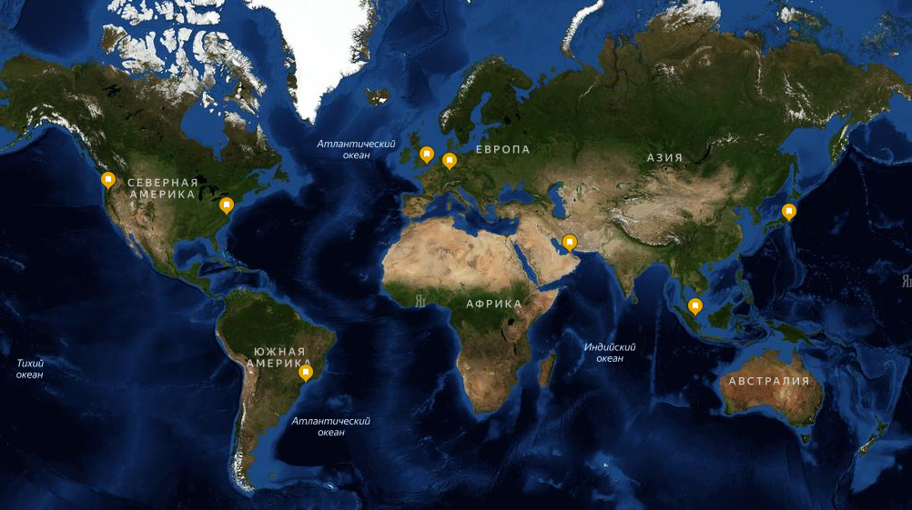
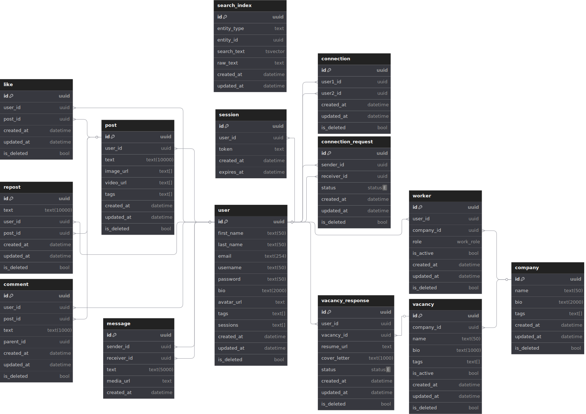
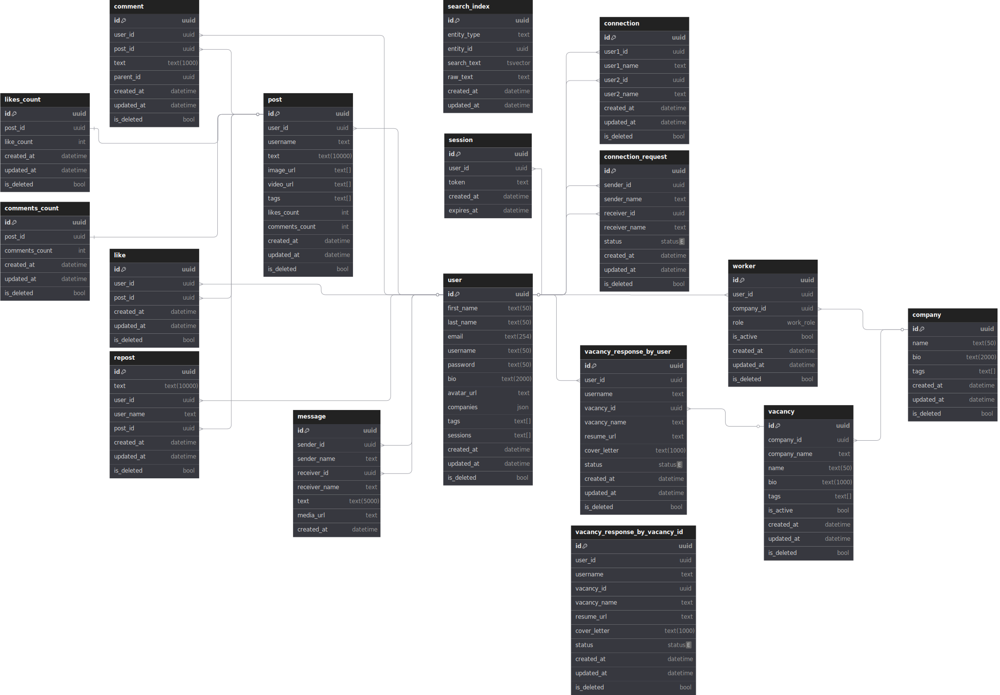

# Проектирование высоконагруженного сервиса на примере LinkedIn

[TOC]

## 1. Тема и целевая аудитория

LinkedIn -- социальная сеть для поиска и установления деловых контактов

### Целевая аудитория

LinkedIn является международным сервисом, распространенным по всему миру, общая аудитория которого более 1.1B пользователей[^1].
Большая часть целевой аудитории расположена в США (234М+ пользователей), преимущественно мужчины (57%)[^2]. 
Количество активных пользователей в месяц (MAU) составляет ~310М[^3].

 
*Распределение пользователей по странам [^1]*

| Регион | Количество пользователей |
|--------------- | --------------- |
| Северная Америка | 260M+ |
| Европа |304M+  |
| Восточная Азия | 326M+  |
| Южная Америка | 188M+   |
| Ближний Восток и Африка | 73M+ |

### Функционал

Ключевой функционал сервиса заключается создания профессионального профиля, установления деловых контактов и поиска работы.

Функционал MVP:
- создание и управление профессиональным профилем
- добавление и управление деловыми контактами
- поиск людей, компаний и вакансий
- обмен сообщениями
- публикация и взаимодействие с контентом (лайки, комментарии, репосты)
- размещение и отклик на вакансии
- система рекомендации людей, компаний и вакансий

## 2. Расчет нагрузки
MAU ~310M[^3]  
DAU ~134M[^4]

### Продуктовые метрики

#### Размер хранилища пользователя

| Данные | Размер |
| --- | --- |
| Аватар | 30 kB |
| Информация | 1 kB |
| Посты | 10 MB |

Размер хранилища на одного пользователя: **10.031 MB**

Общий объем хранилища (для ~1.1B пользователей[^1]): **~10.78 PB**

Последние 5 лет аудитория LinkedIn растет в среднем на 100M пользователей в год[^12] => прирост хранилища в год: **~0.98 PB**

#### Количество действий пользователя по типам в день

В минуту просматривается более 1.7M обновлений ленты[^1] => в день ~2.5B просмотренных постов. Будем считать, что за 1 запрос просмотра постов загружается сразу 10 постов => в день ~250M запросов просмотра постов

В среднем, просмотров контента в 15 раз больше, чем объявлений о вакансиях[^10] => в среднем ~168M просмотренных вакансий. Будем считать, что за 1 запрос просмотра вакансий загружается сразу 10 вакансий => в день ~16.8M запросов просмотра вакансий

Более 30M открытых вакансий в год[^5] => ~83K новых вакансий в день

Более 11K пользователей каждую минуту подают заявки на работу в LinkedIn[^1] => в день ~16M откликов на вакансии

Более 18К новых связей в минуту => ~26M новых связей в день

В среднем на LinkedIn ежедневно отправляется более 100M сообщений[^5]

Ежедневно в LinkedIn публикуется ~2М постов[^6]

В среднем каждый пост на LinkedIn имеет ~24 лайка[^9] => с учетом ежедневного количества постов (~2М) в среднем ~48M лайков в день

В среднем каждый пост на LinkedIn имеет ~3 комментария[^9] => с учетом ежедневного количества постов (~2М) в среднем ~6M комментариев в день

В течение последних 3х лет количество пользователей ежегодно увеличивается на ~100M пользователей[^8] => ~274K регистраций в день

Согласно[^11] до 30% посетителей используют поисковую строку, если она им предоставлена => ~40M поисковых запросов в день

В среднем, каждый пользователь имеет около 1300 связей[^7]

Количество действий рассчитывается относительно активного пользователя

| Тип действия | Среднее количество в день |
| --- | --- |
| Регистрация | 0.002 |
| Авторизация | 1 |
| Просмотр постов | 1.9 |
| Лайк | 0.4 |
| Комментарий | 0.04 |
| Отправка сообщения | 0.75 |
| Публикация поста | 0.015 |
| Создание связи | 0.2 |
| Размещение вакансии | 0.0006 |
| Просмотр вакансий | 0.125 |
| Отклик на вакансию | 0.12 |
| Поиск | 0.3 |

### Технические метрики

Значения рассчитаны с учетом DAU ~134M  
Максимальное RPS примерно в 3 раза больше среднего

Будем считать, что в среднем в ленте пользователь просматривает 10 постов и 10 вакансий, в поиске отображается 10 подходящих постов, 10 человек, 10 вакансий

| Запрос | Количество в день | Среднее RPS | Максимальное RPS | Средний размер запроса | Средний трафик, GB/s | Пиковый трафик, GB/s |
| --- | --- | --- | --- | --- | --- | --- |
| Регистрация | 274K | 3.17 | 9.51 | 1 kB | 0.00000295 | 0.00000886 |
| Авторизация | 134M | 1550.93 | 4652.78 | 10 B | 0.00001444 | 0.00004333 |
| Просмотр постов | 250M | 2893.52 | 8680.56 | 15 MB | 42.39 | 127.16 |
| Лайк | 48M | 555.56 | 1666.67 | 10 B | 0.00000517 | 0.00001552 |
| Комментарий | 6M | 69.44 | 208.33 | 200 B | 0.00001294 | 0.00003881 |
| Отправка сообщения | 100M | 1157.41 | 3472.22 | 100 B | 0.00010779 | 0.00032338 |
| Публикация поста | 2M | 23.15 | 69.44 | 1.5 MB | 0.03234 | 0.09701 |
| Создание связи | 26M | 300.93 | 902.78 | 10 B | 0.00000280 | 0.00000841 |
| Размещение вакансии | 83K | 0.96 | 2.88 | 20 kB | 0.00001789 | 0.00005368 |
| Просмотр вакансий | 1.68M | 19.44 | 58.33 | 400 kB | 0.00371 | 0.01113 |
| Отклик на вакансию | 16M | 185.19 | 555.56 | 1 kB | 0.00017247 | 0.00051740 |
| Поиск | 40M | 462.96 | 1388.88 | 16 MB | 7.23 | 21.7 |
| **Итог** |  | ~7.2K | ~21.7K |  | 49.66 GB/s | 148.97 GB/s |

## 3. Глобальная балансировка нагрузки

### Расположение датацентров

#### Распределение трафика

| Регион | Трафик, % |
| --- | --- |
| Северная Америка | 23% |
| Европа | 27% |
| Восточная Азия | 29%  |
| Южная Америка | 16% |
| Ближний Восток и Африка | 5% |

 
*Расположение датацентров*

#### Выбранные локации дата-центров
1. Северная Америка, 23% трафика
   - Основные:
      - Орегон (западное побережье)
      - Вирджиния (восточное побережье)
   - Дополнительные:
      - Лос-Анджелес
      - Чикаго
      - Торонто

2. Европа, 27% трафика
   - Основные:
      - Франкфурт (Германия)
      - Лондон (Великобритания)
   - Дополнительные:
      - Амстердам
      - Париж
      - Мадрид

3. Восточная Азия, 29% трафика
   - Основные:
      - Токио (Япония)
      - Сингапур
   - Дополнительные:
      - Мумбаи
      - Сеул
      - Гонконг

4. Южная Америка, 16% трафика
   - Основные:
      - Сан-Паулу (Бразилия)
   - Дополнительные:
      - Буэнос-Айрес
      - Богота

5. Ближний Восток и Африка, 5% трафика
   - Основные:
      - Дубай (ОАЭ)
   - Дополнительные:
      - Кейптаун
      - Стамбул

### Расчет нагрузки на датацентры

| Локация | Средний RPS | Максимальное RPS |
| --- | --- | --- |
| Орегон | 830 | 2.5K |
| Вирджиния | 830 | 2.5K |
| Франкфурт | 970 | 27K|
| Лондон | 970 | 2.9K |
| Токио | 970 | 2.9K |
| Сингапур | 1K | 3K |
| Сан-Паулу | 1.1K | 3.3K |
| Дубай | 360 | 1K |

### Схема DNS балансировки
GeoDNS / Latency-based DNS для направления пользователей в ближайший датацентр по географии (на уровне континентов, стран) и нагрузке.

### Схема Anycast балансировки
BGP Anycast для маршрутизации трафика в ближайший доступный датацентр внутри страны при помощи дополнительных датацентров (CDN).

## 4. Локальная балансировка нагрузки

Используем L7-балансировку, так как L3/4 либо добавляет нагрузку на CPU, либо накладывает ограничение, при котором сервера должны быть в одной физической сети и в нашем сервисе нет необходимости балансировать запросы независимо от типа запроса

Балансировка входящих запросов с помощью Kubernetes + Envoy, такой выбор позволяет распределить запросы по кластерам, масштабировать систему и инициирует health checks, обеспечивающие отказоустойчивость

Для межсервисных запросов используется Envoy как sidecar proxy для балансировки, service discovery и терминации SSL

## 5. Логическая схема БД

### Схема БД

## 6. Физическая схема БД

#### Выбор СУБД для хранения таблиц 

| Таблица               | Тип данных | СУБД |
|----------------------|------------|------------------|
| user            | Пользователи, аутентификация | Cassandra |
| session         | Сессии пользователей | Redis |
| company         | Компании, работодатели | Cassandra |
| worker          | Сотрудники компаний | Cassandra |
| vacancy         | Вакансии компаний | Cassandra |
| vacancy_response| Отклики на вакансии | Cassandra |
| connection      | Друзья и подписки | Cassandra |
| connection_request | Запросы на добавление в друзья | Cassandra |
| post           | Посты пользователей | Cassandra |
| like           | Лайки под постами | Cassandra |
| comment        | Комментарии к постам | Cassandra |
| message        | Личные сообщения | Cassandra |
| repost         | Репосты записей | Cassandra |
| search_index | Поиск | ElasticSearch |
| Кэш |  | Redis |
| Медиа |  | AWS S3 |

#### Размер данных

| Таблица | Размер данных, Гб |
|---|---|
| user | 409.78 |
| session  | 37392.60 |
| company | 19.28 |
| post | 2804.45 |
| worker | 96.39 |
| vacancy | 5.63 |
| vacancy_response | 11217.78 |
| connection | 7478.52 |
| connection_request | 1794.84 |
| like | 11965.63 |
| comment | 4487.11 |
| message | 112177.80 |
| repost | 252.40 |
| search_index | 653.23 |

#### Индексы
- `session(user_id)` – индекс для поиска активных сессий  
- `company(name)` – индекс для поиска компаний по названию  
- `worker(company_id, role)` – индекс для поиска сотрудников по компании и роли  
- `vacancy(company_id, is_active)` – индекс для поиска активных вакансий  
- `vacancy_response(user_id)`, `vacancy_response(vacancy_id, status)` – индексы для откликов  
- `connection(user1_id, user2_id)`, `connection_request(sender_id, receiver_id, status)` – индексы для друзей  
- `post(user_id, created_at DESC)` – индекс для получения постов пользователя  
- `like(post_id, created_at DESC)`, `comment(post_id, created_at DESC)` – индексы для быстрого поиска  
- `message(sender_id, receiver_id, created_at DESC)`, `message(receiver_id, sender_id, created_at DESC)` – индексы для поиска сообщений  
- `repost(user_id, created_at DESC)` – индекс для поиска репостов

#### Шардирование
- user по `id`
- session по `user_id`
- vacancy_response по `vacancy_id`
- post по `user_id`
- like по `post_id`
- comment по `post_id`
- message по `(sender_id, receiver_id)`

## Список источников

[^1]: https://news.linkedin.com/about-us
[^2]: https://blog.hootsuite.com/linkedin-demographics
[^3]: https://www.linkedhelper.com/blog/linkedin-demographics
[^4]: https://thesocialshepherd.com/blog/linkedin-statistics
[^5]: https://analyzify.com/statsup/linkedin
[^6]: https://www.cognism.com/blog/linkedin-statistics
[^7]: https://99firms.com/blog/linkedin-statistics
[^8]: https://www.businessofapps.com/data/linkedin-statistics
[^9]: https://www.intotheminds.com/blog/en/linkedin-statistics
[^10]: https://business.linkedin.com/content/dam/me/business/en-us/marketing-solutions/products/pdfs/Platform-Overview-v03.16.pdf
[^11]: https://searchanise.io/blog/navigation-vs-search-box
[^12]: https://www.demandsage.com/linkedin-statistics/
