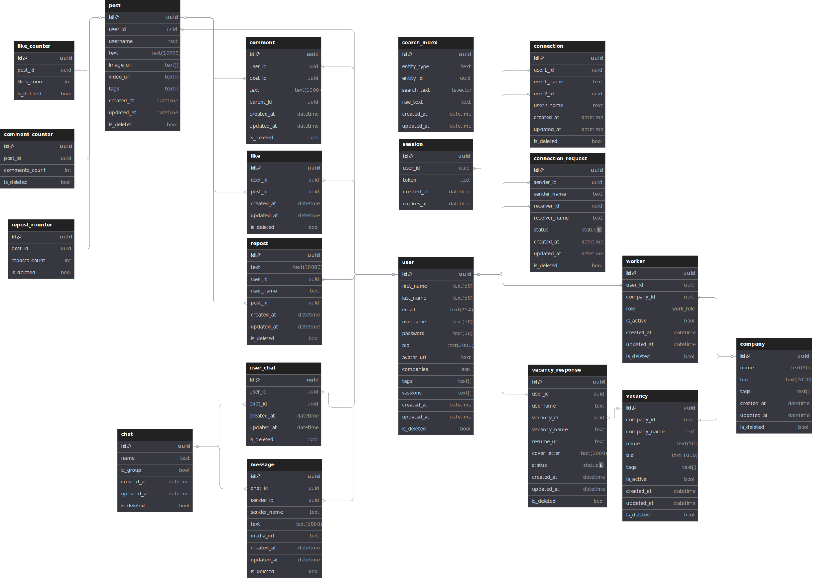

# Проектирование высоконагруженного сервиса на примере LinkedIn

[TOC]

## 1. Тема и целевая аудитория

LinkedIn -- социальная сеть для поиска и установления деловых контактов

### Целевая аудитория

LinkedIn является международным сервисом, распространенным по всему миру, общая аудитория которого более 1.1B пользователей[^1].
Большая часть целевой аудитории расположена в США (234М+ пользователей), преимущественно мужчины (57%)[^2]. 
Количество активных пользователей в месяц (MAU) составляет ~310М[^3].

 
*Распределение пользователей по странам [^1]*

| Регион | Количество пользователей |
|--------------- | --------------- |
| Северная Америка | 260M+ |
| Европа |304M+  |
| Восточная Азия | 326M+  |
| Южная Америка | 188M+   |
| Ближний Восток и Африка | 73M+ |

### Функционал

Ключевой функционал сервиса заключается создания профессионального профиля, установления деловых контактов и поиска работы.

Функционал MVP:
- создание и управление профессиональным профилем
- добавление и управление деловыми контактами
- поиск людей, компаний и вакансий
- обмен сообщениями
- публикация и взаимодействие с контентом (лайки, комментарии, репосты)
- размещение и отклик на вакансии
- система рекомендации людей, компаний и вакансий

## 2. Расчет нагрузки
MAU ~310M[^3]  
DAU ~134M[^4]

### Продуктовые метрики

#### Размер хранилища пользователя

| Данные | Размер |
| --- | --- |
| Аватар | 30 kB |
| Информация | 1 kB |
| Посты | 10 MB |

Размер хранилища на одного пользователя: **10.031 MB**

Общий объем хранилища (для ~1.1B пользователей[^1]): **~10.78 PB**

Последние 5 лет аудитория LinkedIn растет в среднем на 100M пользователей в год[^12] => прирост хранилища в год: **~0.98 PB**

#### Количество действий пользователя по типам в день

В минуту просматривается более 1.7M обновлений ленты[^1] => в день ~2.5B просмотренных постов. Будем считать, что за 1 запрос просмотра постов загружается сразу 10 постов => в день ~250M запросов просмотра постов

В среднем, просмотров контента в 15 раз больше, чем объявлений о вакансиях[^10] => в среднем ~168M просмотренных вакансий. Будем считать, что за 1 запрос просмотра вакансий загружается сразу 10 вакансий => в день ~16.8M запросов просмотра вакансий

Более 30M открытых вакансий в год[^5] => ~83K новых вакансий в день

Более 11K пользователей каждую минуту подают заявки на работу в LinkedIn[^1] => в день ~16M откликов на вакансии

Более 18К новых связей в минуту => ~26M новых связей в день

В среднем на LinkedIn ежедневно отправляется более 100M сообщений[^5]

Ежедневно в LinkedIn публикуется ~2М постов[^6]

В среднем каждый пост на LinkedIn имеет ~24 лайка[^9] => с учетом ежедневного количества постов (~2М) в среднем ~48M лайков в день

В среднем каждый пост на LinkedIn имеет ~3 комментария[^9] => с учетом ежедневного количества постов (~2М) в среднем ~6M комментариев в день

В течение последних 3х лет количество пользователей ежегодно увеличивается на ~100M пользователей[^8] => ~274K регистраций в день

Согласно[^11] до 30% посетителей используют поисковую строку, если она им предоставлена => ~40M поисковых запросов в день

В среднем, каждый пользователь имеет около 1300 связей[^7]

Количество действий рассчитывается относительно активного пользователя

| Тип действия | Среднее количество в день |
| --- | --- |
| Регистрация | 0.002 |
| Авторизация | 1 |
| Просмотр постов | 1.9 |
| Лайк | 0.4 |
| Комментарий | 0.04 |
| Отправка сообщения | 0.75 |
| Публикация поста | 0.015 |
| Создание связи | 0.2 |
| Размещение вакансии | 0.0006 |
| Просмотр вакансий | 0.125 |
| Отклик на вакансию | 0.12 |
| Поиск | 0.3 |

### Технические метрики

Значения рассчитаны с учетом DAU ~134M  
Максимальное RPS примерно в 3 раза больше среднего

Будем считать, что в среднем в ленте пользователь просматривает 10 постов и 10 вакансий, в поиске отображается 10 подходящих постов, 10 человек, 10 вакансий

| Запрос | Количество в день | Среднее RPS | Максимальное RPS | Средний размер запроса | Средний трафик, GB/s | Пиковый трафик, GB/s |
| --- | --- | --- | --- | --- | --- | --- |
| Регистрация | 274K | 3.17 | 9.51 | 1 kB | 0.00000295 | 0.00000886 |
| Авторизация | 134M | 1550.93 | 4652.78 | 10 B | 0.00001444 | 0.00004333 |
| Просмотр постов | 250M | 2893.52 | 8680.56 | 15 MB | 42.39 | 127.16 |
| Лайк | 48M | 555.56 | 1666.67 | 10 B | 0.00000517 | 0.00001552 |
| Комментарий | 6M | 69.44 | 208.33 | 200 B | 0.00001294 | 0.00003881 |
| Отправка сообщения | 100M | 1157.41 | 3472.22 | 100 B | 0.00010779 | 0.00032338 |
| Публикация поста | 2M | 23.15 | 69.44 | 1.5 MB | 0.03234 | 0.09701 |
| Создание связи | 26M | 300.93 | 902.78 | 10 B | 0.00000280 | 0.00000841 |
| Размещение вакансии | 83K | 0.96 | 2.88 | 20 kB | 0.00001789 | 0.00005368 |
| Просмотр вакансий | 1.68M | 19.44 | 58.33 | 400 kB | 0.00371 | 0.01113 |
| Отклик на вакансию | 16M | 185.19 | 555.56 | 1 kB | 0.00017247 | 0.00051740 |
| Поиск | 40M | 462.96 | 1388.88 | 16 MB | 7.23 | 21.7 |
| **Итог** |  | ~7.2K | ~21.7K |  | 49.66 GB/s | 148.97 GB/s |

## 3. Глобальная балансировка нагрузки

### Расположение датацентров

#### Распределение трафика

| Регион | Трафик, % |
| --- | --- |
| Северная Америка | 23% |
| Европа | 27% |
| Восточная Азия | 29%  |
| Южная Америка | 16% |
| Ближний Восток и Африка | 5% |

 
*Расположение датацентров*

#### Выбранные локации дата-центров
1. Северная Америка, 23% трафика
   - Основные:
      - Орегон (западное побережье)
      - Вирджиния (восточное побережье)
   - Дополнительные:
      - Лос-Анджелес
      - Чикаго
      - Торонто

2. Европа, 27% трафика
   - Основные:
      - Франкфурт (Германия)
      - Лондон (Великобритания)
   - Дополнительные:
      - Амстердам
      - Париж
      - Мадрид

3. Восточная Азия, 29% трафика
   - Основные:
      - Токио (Япония)
      - Сингапур
   - Дополнительные:
      - Мумбаи
      - Сеул
      - Гонконг

4. Южная Америка, 16% трафика
   - Основные:
      - Сан-Паулу (Бразилия)
   - Дополнительные:
      - Буэнос-Айрес
      - Богота

5. Ближний Восток и Африка, 5% трафика
   - Основные:
      - Дубай (ОАЭ)
   - Дополнительные:
      - Кейптаун
      - Стамбул

### Расчет нагрузки на датацентры

| Локация | Средний RPS | Максимальное RPS |
| --- | --- | --- |
| Орегон | 830 | 2.5K |
| Вирджиния | 830 | 2.5K |
| Франкфурт | 970 | 2.7K|
| Лондон | 970 | 2.9K |
| Токио | 970 | 2.9K |
| Сингапур | 1K | 3K |
| Сан-Паулу | 1.1K | 3.3K |
| Дубай | 360 | 1K |

### Схема DNS балансировки
GeoDNS / Latency-based DNS для направления пользователей в ближайший датацентр по географии (на уровне континентов, стран) и нагрузке.

### Схема Anycast балансировки
BGP Anycast для маршрутизации трафика в ближайший доступный датацентр внутри страны при помощи дополнительных датацентров (CDN).

## 4. Локальная балансировка нагрузки
Сервис обрабатывает достаточно большой трафик: средний трафик 49.66 GB/s = 397.28 Gb/s, максимальный трафик 148.97 GB/s = 1.2 Tb/s -- при этом, наибольшая нагрузка на сервер составляет ~15% трафика, поэтому необходима балансировка и на 3/4 (балансирует запросы вне зависимости от типа запроса и того, какой верхнеуровненвый протокол (HTTP, gRPC и т.д.) находится внутри), и на 7 уровнях (балансировка запроса между бэкендами).

Используем L4-балансировку по механизму Virtual Server via Direct Routing (VS-DR), который обладает высокой производительностью за счет отправки запроса напрямую на бэкенд, меняя MAC-адрес назначения, и возврата ответа клиенту по IP в обход балансировщика этого уровня. Минусом этого механизма является ограничение, при котором сервера должны быть в одной физической сети, которое выполняется, так как эта балансировка происходит уже внутри ДЦ после глобальной балансировки, соответственно, сервера уже находятся в одной физической сети. В итоге балансировка на этом уровне обеспечит распределение трафика между ingress-нодами балансировщика более высокого уровня. В качестве L4-балансировщиков используется сетевые карты 25 Gb/s, а их количество определяется количеством трафика на дата-центр. Трафик на L7 балансировщики распределяется обычным round robin, так как на данном этапе достаточно просто распределить трафик на них.

Для L7-балансировки входящих запросов используем Kubernetes + Envoy. Такой выбор обеспечивает масштабируемость и отказоустойчивость системы. Envoy, работая как ingress-контроллер, выполняет маршрутизацию, SSL-терминацию, retry и health checks. Kubernetes позволяет горизонтально масштабировать поды, автоматически перераспределяя нагрузку между ними.

Для межсервисных запросов используется Envoy как sidecar proxy для балансировки (включая ретраи, таймауты), service discovery и терминации SSL.

## 5. Логическая схема БД

### Схема БД

## 6. Физическая схема БД

#### Выбор СУБД для хранения таблиц 

Для расчета количества записей будем считать статистику за 5 лет

| Таблица | Тип данных | Количество записей | Размер данных | Нагрузка на чтение | Нагрузка на запись | СУБД |
| --- | --- | --- | --- | --- | --- | --- |
| user | Пользователи, аутентификация | 1.1B | 409.78 GB | ~1 RPS | 3 RPS | Cassandra |
| session | Сессии пользователей | 1.1B | 123.2 GB | 1.5K RPS | 3 RPS | Redis |
| company | Компании, работодатели | 67M | 19.28 GB | ~185 RPS | ~1 RPS | Cassandra |
| worker | Сотрудники компаний | 6.7B | 96.39 GB | ~1 RPS | ~1 RPS | Cassandra |
| vacancy | Вакансии компаний | 150M | 5.63 GB | 20 RPS | 1 RPS | Cassandra |
| vacancy_response | Отклики на вакансии | 29.2B | 11.22 TB | ~1 RPS | 185 RPS | Cassandra |
| connection | Связи между пользователями | 1430B | 7.48 TB | ~1 RPS | 300 RPS | Cassandra |
| connection_request | Запросы на создание связи | 47B | 1.79 TB | ~300 RPS | 300 RPS | Cassandra |
| post | Посты пользователей | 3.6B | 2.80 TB | 2.8K RPS | 20 RPS | Cassandra |
| like | Лайки под постами | 87.6M | 11.97 GB | ~1 RPS | 550 RPS | Kafka, Cassandra |
| comment | Комментарии к постам | 5.5B | 4.49 TB | ~1 RPS | 7 RPS | Kafka, Cassandra |
| repost | Репосты | 36M | 252.4 GB | ~1 RPS | ~1 RPS | Kafka, Cassandra |
| like_counter | Статистика лайков | 3.6B | 180 GB | 2.8K RPS | 550 RPS | Kafka, Tarantool |
| comment_counter | Статистика комментариев | 3.6B | 180 GB | 2.8K RPS | 7 RPS | Kafka, Tarantool |
| repost_counter | Статистика репостов | 3.6B | 180 GB | 2.8K RPS | ~1 RPS | Kafka, Tarantool |
| chat | Информация о чате | 22B | 620 GB | 1.2K RPS | ~1 RPS | Cassandra |
| user_chat | Участники чата | 110B | 3.1 TB | 1.2K RPS | ~1 RPS | Cassandra |
| message | Сообщения в чате | 182.5B | 112.18 TB | 1.2K RPS | 1.2K RPS | Cassandra |
| search_index | Поиск | 4.9B | 653.23 GB | 460 RPS | 25 RPS | ElasticSearch |
|  | Кэш |  |  |  |  | Redis |
|  | Медиа |  |  |  |  | AWS S3 |

#### Индексы
Большая часть данных хранится в Cassandra -- NoSQL БД, в которой основным механизмом эффективного доступа является партиционириование с использованием `PRIMARY KEY`, состоящего из `partition key` (уникальный ключ) и `clustering columns` (столбцы, на основе которых происходит кластеризация данных), а не применение индексов:
- `worker`: `((company_id), role, is_active)`
- `vacancy`: `((company_id), is_active, created_at)`
- `like`, `repost`: `((post_id), user_id, created_at)`

По умолчанию `partition key` будем считать `id`, `clustering columns` пустые. 

Для таблиц-счетчиков `like_counter`, `comment_counter`, `repost_counter`, хранящихся в Tarantool, будем использовать индекс по `(post_id)`.

#### Шардирование
Шардируем следующие таблицы, т.к. из-за большого объема данных индексы не поместятся в оперативную память и будет слишком долгое чтение:  
- `vacancy_response` по `vacancy_id` (просмотр откликов на вакансию происходит чаще, чем пользователь просматривает все свои отклики, поэтому выгоднее, чем по `user_id`)
- `connection` по `user1_id`
- `connection_request` по `receiver_id` (просмотр входящих запросов происходит чаще, чем отправленных)
- `post` по `user_id`
- `comment` по `post_id`
- `user_chat` по `user_id` (просмотр всех своих чатов пользователем происходит чаще, чем загрузка участников чата)
- `message` по `chat_id`

Все таблицы имеют небольшую нагрузку на запись, поэтому шардирование из-за большой нагрузки на запись не понадобится

#### Резервирование
- в Cassandra использовать репликацию с 3мя репликами в каждом дата-центре с уровнем консистентности LOCAL_QUORUM и стратегией NetworkTopologyStrategy. Такая схема позволяет расположить реплики на разных стойках в одном дата-центре, обеспечить консистентность данных и минимизировать задержки внутри дата-центра

## 8. Технологии

| Технология | Область применения | Мотивационная часть |
| --- | --- | --- |
| Go | backend | высокая производительность, эффективная работа с многопоточностью, низкое потребление ресурсов, оптимизирован для построения высоконагруженных микросервисов |
| JS (React + TS) | frontend | высокая отзывчивость интерфейса, переиспользуемость компонентов, строгая типизация, улучшенная масштабируемость фронтенда |
| Docker | контейнеризация | изоляция окружений, лёгкое масштабирование, воспроизводимость, удобство для CI/CD |
| Kubernetes | управление контейнерами | автоматическое масштабирование, отказоустойчивость, управление жизненным циклом контейнеров, обновления без простоев |
| Python | ML-рекомендации | 	множество ML-библиотек, быстрое прототипирование, удобство разработки моделей, популярность в сообществе |
| Envoy | балансировка, SSL-терминация | высокая производительность, поддержка L7 маршрутизации, трассировка запросов, SSL-терминация, быстрое применение новых конфигураций |
| Cassandra | основная БД | NoSQL, горизонтальное масштабирование, высокая доступность, отсутствие единой точки отказа, оптимизирована под высокую скорость записи |
| Kafka | обработки потоковых данных | высокая пропускная способность, устойчивость к сбоям, масштабируемость, поддержка обработки в реальном времени|
| Redis | хранение сессий, кэш | низкая задержка, работа in-memory, высокая скорость чтения и записи, поддержка TTL и структур данных |
| ElasticSearch | поиск | полнотекстовый поиск, высокая скорость отклика, масштабируемость, поддержка агрегаций и фильтрации |
| ClickHouse | запись логов | высокая скорость аналитических запросов, колоночное хранилище, оптимизация под большие объёмы данных, поддержка распределённых запросов |
| AWS S3 | хранение медиа-файлов | масштабируемость, высокая доступность, отказоустойчивость, простая интеграция с другими сервисами |
| Jenkins | автоматизация развертывания | гибкость в настройке, поддержка плагинов, автоматизация CI/CD, интеграция с различными системами контроля версий и облаками |
| Prometheus | мониторинг | сбор метрик в реальном времени, язык запросов PromQL, поддержка многомерных данных, автономная работа, интеграция с Kubernetes, эффективное хранение временных рядов |
| Grafana | визуализация метрик | гибкие дашборды, поддержка множества источников данных (Prometheus, Elasticsearch), настраиваемые алерты, удобство анализа больших объёмов метрик |

## 9. Обеспечение надёжности

### Graceful shutdown
- завершаем активные соединения и запросы без потери данных

### Graceful degradation
- для не принципиально важных сервисов (счетчики, лайки, комменты, репосты) и тех, для которых нельзя выдать неактуальные данные (сообщения, чаты), игнорируем и выдаем ошибку
- для остальных сервисов выдаем кэшированную версию

### CQRS (Command Query Responsibility Segregation)
- разделяем пайплайны на запись (асинхронный запрос) и на чтение (синхронный запрос)

### Отбивка статистики
- каждый сервис асинхронно пишет логи и статистику в ClickHouse и Prometheus, оттуда выводится в Grafana

### outbox
- данные по статистике постов пишутся в БД (Tarantool), затем в брокер сообщений (Kafka) для передачи в сервис подсчета 

## 10. Схема проекта

## 11. Список серверов
### Расчет ресурсов
Грубое удельное потребление ресурсов на один экземпляр процесса, либо на одно ядро:

| Технология| Характер сервиса | RPS | RAM |
| ------ | ----- | ---- | --- |
| Django | тяжелая бизнес-логика | 1 | 1 Gb |
| C++, Go | тяжелая бизнес-логика | 10 | 100 Mb |
| Django | средняя бизнес-логика | 10 | 100 Mb |
| C++, Go | средняя бизнес-логика | 100 | 100 Mb |
| Nginx | SSL handshake (CPS) | 500 | 10 Mb |
| Django | легкое JSON API | 500 | 100 Mb |
| С++, Go | легкое JSON API, СУБД | 5000 | 10 Mb |

Для оценки необходимых ресурсов будем использовать таблицу выше:

| Сервис | Пиковая нагрузка, RPS | Сложность сервиса | CPU | RAM | Трафик, Gb/s |
| --- | --- | --- |  --- | --- | --- |
| chat | 3.5K | средняя | 35 | 3.5 Gb | 0.003 |
| auth | 4.7K | легкая | 1 | 10 Mb | 0.0002 |
| user | 12 | средняя | 1 | 100 Mb | 0.00001 |
| company | 560 | легкая | 1 | 10 Mb | 0.00001 |
| post | 8.7K | тяжелая | 87 | 87 Gb | 1016 |
| vacancy | 620 | легкая | 1 | 10 Mb | 0.085 |
| search | 1.5K | средняя | 15 | 15 Gb | 0.001 |
| recommendation | 8.7K | тяжелая | 870 | 87 Gb | 0.01 |
| connection | 900 | легкая | 1 | 10 Mb | 0.0001 |
| like | 1.7K | легкая | 1 | 10 Mb | 0.0001 |
| comment | 200 | легкая | 1 | 10 Mb | 0.00001 |
| repost | 1 | легкая | 1 | 10 Mb | 0.00001 |
| stats | 1.9K | средняя | 19 | 1.9 Gb | 0.002 |
| API-Gateway | 21.7K | легкая | 5 | 50 Mb | 148.97 |
| L4 балансировщики | 21.7K | SSL handshake (CPS) | 44 | 440 Mb | 148.97 |
| Envoy | 21.7K | SSL handshake (CPS) | 44 | 440 Mb | 148.97 |
| Cassandra | 28.5K | легкая | 6 | 60 Mb | 0.114 |
| Kafka | 27.3K | легкая | 6 | 6 Mb | 0.0437 |
| Redis | 4.5K | легкая | 2 | 20 Mb | 0.0036 |
| Tarantool | 27K | легкая | 6 | 60 Mb | 0.0086 |
| ElasticSearch | 1.4K | легкая | 1 | 10 Mb | 0.0112 |
| ClickHouse | 2K | легкая | 1 | 10 Mb | 0.001 |
| AWS S3 | 4K | легкая | - | - | 3.2 |
| Prometheus | 2K | легкая | 1 | 10 Mb | 0.001 |

### Определение конфигураций

#### Stateless-сервисы (Kubernetes Pods)

| Название | Хостинг | Конфигурация | Cores | Cnt | Покупка | Аренда |
| --- | --- | --- | --- | --- | --- | --- |
| kubenode | own | Intel Xeon Silver 4314 16 Cores/64GB RAM/1xNVMe2TB/1x25Gb/s | 1034 | 65 |  ~$5000 | - |
| kubenode | AWS | m6i.2xlarge (8vCPU/32GB) | 1034 | 130 | - | $0.0635 |

#### Stateful-сервисы (БД и очереди)

| Название | Хостинг | Конфигурация | Cores | Cnt | Покупка | Аренда |
| --- | --- | --- | --- | --- | --- | --- |
| Cassandra | own | Intel Xeon Silver 4314 16 Cores/64GB RAM/1xNVMe2TB/1x25Gb/s | 6 | 1 |  ~$5000 | - |
| Cassandra | AWS | r6i.2xlarge (8vCPU/64GB) | 6 | 1 | - | $0.3334 |
| Kafka | own | Intel Xeon Silver 4314 16 Cores/64GB RAM/1xNVMe2TB/1x25Gb/s | 6 | 1 |  ~$5000 | - |
| Kafka | AWS | r6i.2xlarge (8vCPU/64GB) | 6 | 1 | - | $0.3334 |
| Redis | own | Intel Xeon Silver 4314 16 Cores/64GB RAM/1xNVMe2TB/1x25Gb/s | 2 | 1 |  ~$5000 | - |
| Redis | AWS | r6i.2xlarge (8vCPU/64GB) | 2 | 1 | - | $0.3334 |
| Tarantool | own | Intel Xeon Silver 4314 16 Cores/64GB RAM/1xNVMe2TB/1x25Gb/s | 6 | 1 |  ~$5000 | - |
| Tarantool | AWS | r6i.2xlarge (8vCPU/64GB) | 6 | 1 | - | $0.3334 |
| ElasticSearch | own | Intel Xeon Silver 4314 16 Cores/64GB RAM/1xNVMe2TB/1x25Gb/s | 1 | 1 |  ~$5000 | - |
| ElasticSearch | AWS | r6i.2xlarge (8vCPU/64GB) | 1 | 1 | - | $0.3334 |
| ClickHouse | own | Intel Xeon Silver 4314 16 Cores/64GB RAM/1xNVMe2TB/1x25Gb/s | 1 | 1 |  ~$5000 | - |
| ClickHouse | AWS | r6i.2xlarge (8vCPU/64GB) | 1 | 1 | - | $0.3334 |
| Prometheus | own | Intel Xeon Silver 4314 16 Cores/64GB RAM/1xNVMe2TB/1x25Gb/s | 1 | 1 |  ~$5000 | - |
| Prometheus | AWS | r6i.2xlarge (8vCPU/64GB) | 1 | 1 | - | $0.3334 |

#### Общая стоимость за 5 лет
| Вариант               | Stateless       | Stateful    | Всего         |
|-----------------------|-----------------|-------------|---------------|
| Собственный DC        | $325,000        | $35,000     | $360,000      |
| AWS (аренда)          | $3,633,444      | $102,263    | $3,735,707    |

## Список источников

[^1]: https://news.linkedin.com/about-us
[^2]: https://blog.hootsuite.com/linkedin-demographics
[^3]: https://www.linkedhelper.com/blog/linkedin-demographics
[^4]: https://thesocialshepherd.com/blog/linkedin-statistics
[^5]: https://analyzify.com/statsup/linkedin
[^6]: https://www.cognism.com/blog/linkedin-statistics
[^7]: https://99firms.com/blog/linkedin-statistics
[^8]: https://www.businessofapps.com/data/linkedin-statistics
[^9]: https://www.intotheminds.com/blog/en/linkedin-statistics
[^10]: https://business.linkedin.com/content/dam/me/business/en-us/marketing-solutions/products/pdfs/Platform-Overview-v03.16.pdf
[^11]: https://searchanise.io/blog/navigation-vs-search-box
[^12]: https://www.demandsage.com/linkedin-statistics/
